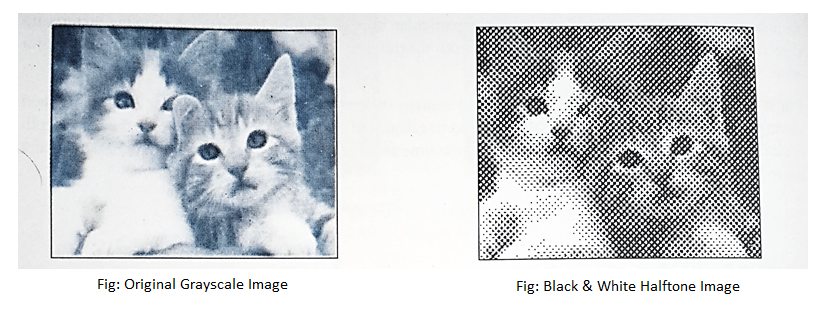
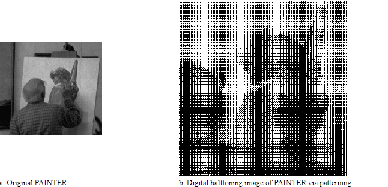
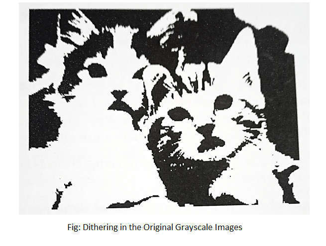

Nama : Maisya Puspita Sari
NIM : 2110131320006
TUGAS 4 ULASAN HALFTONNING, PATTERNING & DITHERNING
_____

### 1. Halftone

 Halftone adalah jenis efek visual statis yang diterapkan pada gambar digital dan cetak. Ini bekerja dengan prinsip yang sangat sederhana, di mana setiap piksel dalam area gambar dianggap sebagai titik dengan ukuran berbeda, beberapa di antaranya memakan lebih banyak ruang daripada satu piksel. Ketika gambar/gambar diubah menjadi halftone, tekstur gambar muncul seolah-olah telah ditempelkan di atas kumpulan titik tak terbatas tetapi tidak kontinu. Titik-titik tersebut sebenarnya tidak terbatas tetapi setara dengan resolusi total gambar. Gambar/gambar yang dihasilkan dikenal sebagai gambar halftone. Halftone adalah jenis efek visual statis yang diterapkan pada gambar digital dan cetak. Ini bekerja dengan prinsip yang sangat sederhana, di mana setiap piksel dalam area gambar dianggap sebagai titik dengan ukuran berbeda, beberapa di antaranya memakan lebih banyak ruang daripada satu piksel. Ketika gambar/gambar diubah menjadi halftone, tekstur gambar muncul seolah-olah telah ditempelkan di atas kumpulan titik tak terbatas tetapi tidak kontinu. Titik-titik tersebut sebenarnya tidak terbatas tetapi setara dengan resolusi total gambar. 

 Halftoning juga dikenal sebagai proses pencetakan gambar nada terus menerus di koran, majalah dan buku menggunakan printer bi-level. Dalam kasus pencetakan hitam putih, seseorang tidak dapat langsung mencetak banyak warna abu-abu hanya dengan menggunakan tinta hitam murni pada mesin cetak. Apa yang dilakukannya adalah, buat pola titik dengan mengekspos negatif melalui layar halus ke pelat cetak fotosensitif. Ukuran titik bervariasi tergantung pada kehalusan layar dan lama pencahayaan. Di area di mana gambarnya gelap, pelat akan mencetak titik-titik tinta yang besar, begitu besar dan padat sehingga titik-titik itu bahkan mungkin tumpang tindih. Di area di mana gambarnya terang, hanya titik-titik tinta terkecil yang dicetak. Titik-titik itu menyatu, baik di atas kertas maupun di mata kita, untuk memberikan ilusi nada kontinu yang meyakinkan. Gambar yang dicetak seperti itu terdiri dari serangkaian ukuran yang bervariasi & titik kepadatan yang bervariasi dalam pola tertentu untuk mensimulasikan tampilan nada kontinu yang umumnya dikenal sebagai Halftones. Halftone warna terdiri dari serangkaian titik dalam cyan, magenta, kuning dan hitam (CMYK) yang menipu mata untuk melihat jutaan warna yang membentuk Gambar asli.

#### 1.1 Patterning

 Patterning adalah yang teknik paling sederhana dari tiga teknik untuk menghasilkan gambar halftoning digital. Ini menghasilkan gambar yang memiliki resolusi spasial lebih tinggi daripada gambar sumber. Jumlah sel halftone citra keluaran sama dengan jumlah piksel citra sumber. Namun, setiap sel halftone dibagi lagi menjadi kotak 4x4. Setiap nilai piksel input diwakili oleh jumlah kotak terisi yang berbeda dalam sel halftone. Karena kisi 4x4 hanya dapat mewakili 17 tingkat intensitas yang berbeda, gambar sumber harus dikuantisasi.

 Patterning menghasilkan gambar halftoning digital dari gambar input menggunakan teknik pola. Pola program membaca gambar input, mengkuantisasi nilai piksel, dan memetakan setiap piksel ke pola yang sesuai. Gambar yang dihasilkan 16 kali lebih besar dari aslinya. Gambar yang dihasilkan ditulis ke file output sebagai file TIFF. Sebuah kata peringatan: "pola" membutuhkan banyak perhitungan, gambar berukuran kurang dari 100x100 direkomendasikan.

#### 1.2 Ditherning

Ini adalah efek yang digunakan di banyak tempat berbeda, termasuk grafik 2D biasa dan juga dalam pencetakan. Dalam 3D, Ini digunakan sebagian besar untuk menampilkan warna yang lebih realistis tanpa perlu meningkatkan kedalaman warna gambar.Sekarang mari kita jelaskan konsep dasar dan teknik dithering. Kita tahu bahwa untuk mewakili objek dunia nyata di layar komputer, kita perlu memiliki sistem grafis "Warna Sejati" yang mampu menampilkan 16777216 (16 juta) warna berbeda. Tetapi ketika tidak begitu banyak warna berbeda tersedia dalam sistem. Teknik ini dapat diadopsi untuk membuat gambar dengan warna yang tampak, sebenarnya tidak ada. 

Teknik ini dikenal sebagai Dithering. Ini digunakan dalam grafik komputer untuk menciptakan ilusi warna tambahan pada tampilan warna atau printer. Tidak seperti patherning, dithering membuat gambar keluaran dengan jumlah titik yang sama dengan jumlah piksel pada gambar sumber. Dithering dapat dianggap sebagai thresholding gambar sumber dengan matriks gentar. Matriks diletakkan berulang kali di atas gambar sumber. Dimanapun nilai piksel gambar lebih besar dari nilai dalam matriks, titik pada gambar output diisi. Masalah dithering yang terkenal adalah menghasilkan artefak pola yang diperkenalkan oleh matriks ambang batas tetap. Gambar 4.5 menunjukkan contoh operasi dithering.

