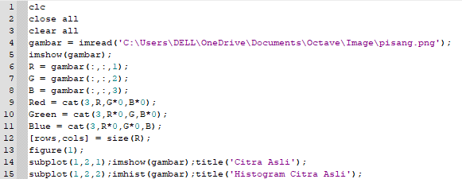
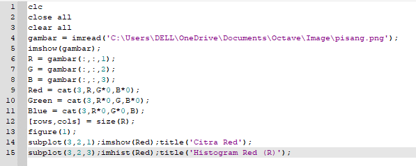
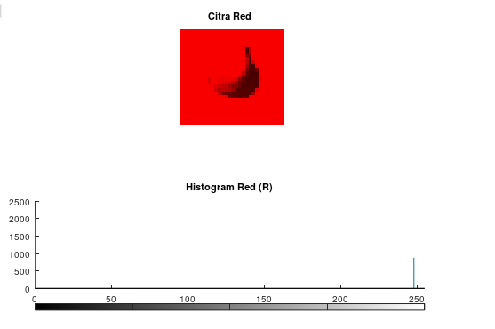
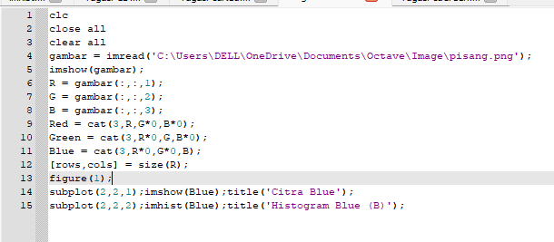
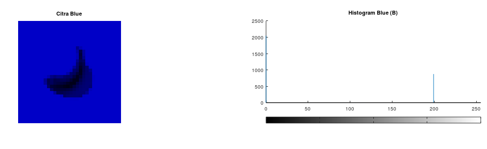
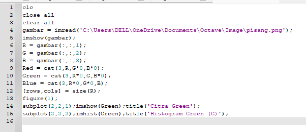
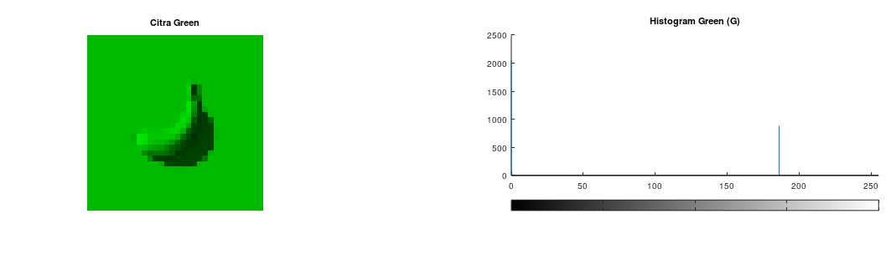

Nama : Maisya Puspita Sari
NIM : 2110131320006

_________

Pengolahan citra digital adalah manipulasi dan interprestasi digital dari citra dengan bantuan komputer. Pengolahan citra bertujuan untuk:

1. memperbaiki kualitas gambar, dilihat dari aspek radiometric dan aspek geometric. Aspek radiometric terdiri dari peningkatan kontras      restorasi citra, transformasi warna sedangkan aspek geometric terdiri dari rotasi, skala, translasi, trnsformasi geometric).
2. melakukan proses penarikan informasi atau deskripsi obyek atau pengenalan obyek yang terkandung pada citra.
3. melakukan pemilihan citra ciri (feature images) yang optimal untuk tujuan analisis.
4. melakukan kompresi atau reduksi data untuk tujuan penyimpanan data, transmisi data, dan waktu proses data.

Dalam bidang pengolahan citra digital dikenal berbagai macam ruang warna (color space) citra yang paling umum adalah ruang warna RGB (Red, Green, Blue).

 Red (Merah), Green (Hijau) dan Blue (Biru) merupakan warna dasar yang dapat diterima oleh mata manusia. Setiap piksel pada citra warna mewakili warna yang merupakan kombinasi dari ketiga warna dasar RGB. Setiap titik pada citra warna membutuhkan data sebesar 3 byte. Setiap warna dasar memiliki intensitas tersendiri dengan nilai minimum nol (0) dan nilai maksimum 255 (8 bit). RGB didasarkan pada teori bahwa mata manusia peka terhadap panjang gelombang 630nm (merah), 530 nm (hijau), dan 450 nm (biru).

 Pada tugas kali ini diminta untuk mengeksplorasi gambar berukuran 32x32 dengan format PNG, JPEG, atau JPG dimana gambar akan di eksplorasi pada Octave dengan menggunakan fungsi imread, imhist, dan imshow.

Hasil Eksplorasi :

 Di atas adalah gambar yang saya gunakan.

Di atas adalah kode untuk menampilkan Hostogram dari gambar yang saya gunakan. 

 Hasil Histogram Gambar Pisang

Di atas adalah kode untuk menampilkan kanel Red dari gambar yang saya gunakan. 

Hasil Kanel Red Pada Gambar Pisang

Di atas adalah kode untuk menampilkan kanel Blue dari gambar yang saya gunakan.

Hasil Kanel Blue Pada Gambar Pisang

Di atas adalah kode untuk menampilkan kanel Green dari gambar yang saya gunakan.

 Hasil Kanel Green Pada Gambar Pisang

Keterangan Fungsi :
1. imread : Imread (images read) digunakan untuk membaca citra menjadi sebuah data matriks. Format citra yang dapat dibaca oleh MATLAB bermacam-macam seperti BMP, JPG, TIF, PNG dan sebagainya.
2. imhist : Imshow (images show) digunakan untuk menampilkan data matriks menjadi sebuah gambar.
3. imshow :  menampilkan gambar dari data yang telah kita baca sebelumnya/ditampung pada sebuah variabel.
