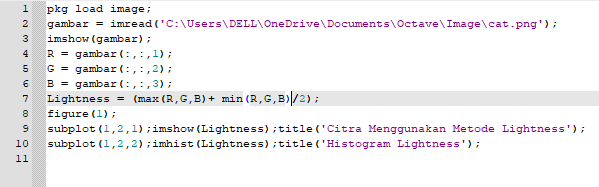
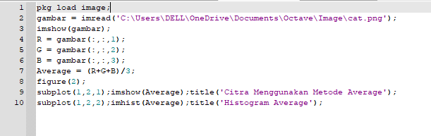
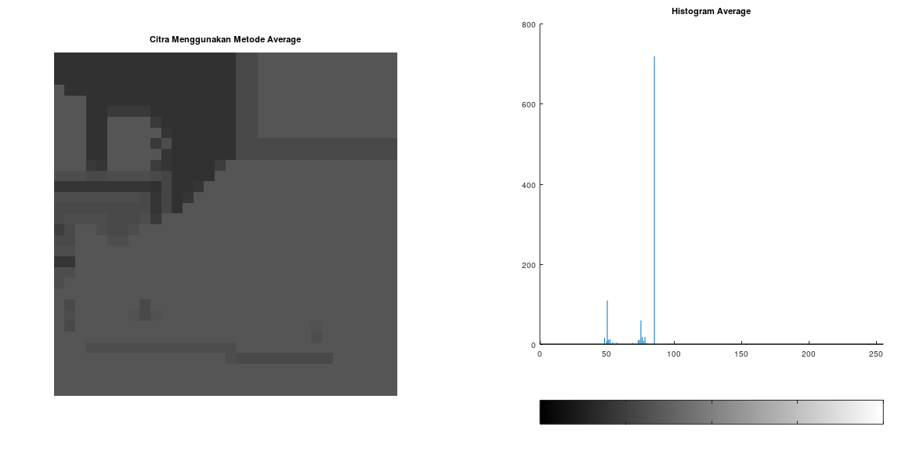
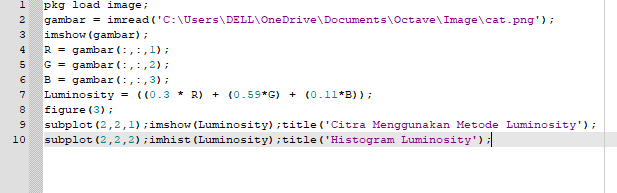
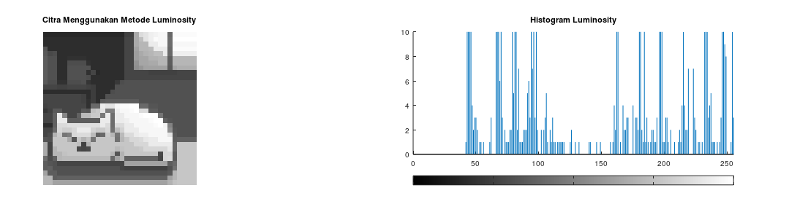

Nama : Maisya Puspita Sari
NIM : 2110131320006
**Tugas 3 Mengubah RGB ke Grayscale Menggunakan 3 Metode (Lightness, Average, & Luminosity)**
____
1. Lightness
   

   Penjelasan :

   * **pkg load image** : Merupakan fungsi untuk mengaktifkan package image.
   * **variabel gambar**  : Merupakan variabel fungsi imread (untuk membaca gambar) disimpan.
   * **imshow** : Merupakan fungsi untuk menampilkan gambar.
   * **RGB** : Merupakan varaibel untuk pernyataan lapisan atau kernel berapa yang diambil dan disimpan untuk setiap variabel RGB.
   * **Lightness** = (max(R,G,B) + min(R,G,B)  /2); : Merupakan rumus mengubah RGB menjadi Grayscale dengan rumus lightness.
   * **figure(1)** : Merupakan nama tab nya nanti ketika dijalankan.
   * **subplot** : Merupakan fungsi untuk memasukkan objek ke dalam figure 1
   * **imhist** : Merupakan fungsi untuk menampilkan histogram gambar.

    
    
    Hasilnya : 
   

   
2. Average
   

    * **pkg load image** : Merupakan fungsi untuk mengaktifkan package image.
   * **variabel gambar**  : Merupakan variabel fungsi imread (untuk membaca gambar) disimpan.
   * **imshow** : Merupakan fungsi untuk menampilkan gambar.
   * **RGB** : Merupakan varaibel untuk pernyataan lapisan atau kernel berapa yang diambil dan disimpan untuk setiap variabel RGB.
   * **Average = (R+G+B)/3;** : Merupakan rumus mengubah RGB menjadi Grayscale dengan rumus lightness.
   * **figure(2)** : Merupakan nama tab nya nanti ketika dijalankan.
   * **subplot** : Merupakan fungsi untuk memasukkan objek ke dalam figure 2
   * **imhist** : Merupakan fungsi untuk menampilkan histogram gambar.

    Hasilnya :
   

3. Luminosity
   
   

   * **pkg load image** : Merupakan fungsi untuk mengaktifkan package image.
   * **variabel gambar**  : Merupakan variabel fungsi imread (untuk membaca gambar) disimpan.
   * **imshow** : Merupakan fungsi untuk menampilkan gambar.
   * **RGB** : Merupakan varaibel untuk pernyataan lapisan atau kernel berapa yang diambil dan disimpan untuk setiap variabel RGB.
   * **Luminosity = ((0.3 * R) + (0.59*G) + (0.11*B));** : Merupakan rumus mengubah RGB menjadi Grayscale dengan rumus lightness.
   * **figure(2)** : Merupakan nama tab nya nanti ketika dijalankan.
   * **subplot** : Merupakan fungsi untuk memasukkan objek ke dalam figure 2
   * **imhist** : Merupakan fungsi untuk menampilkan histogram gambar.
    Hasilnya :
   

