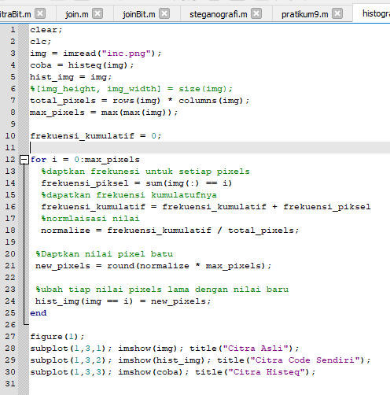
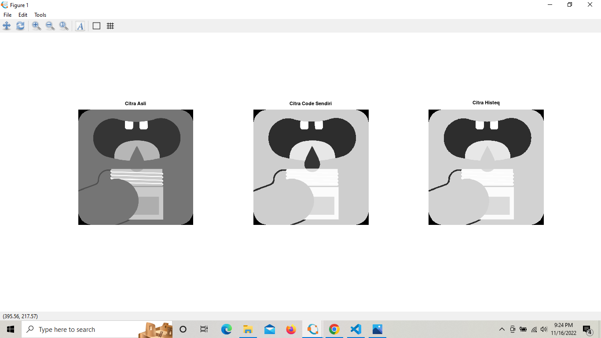
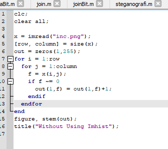
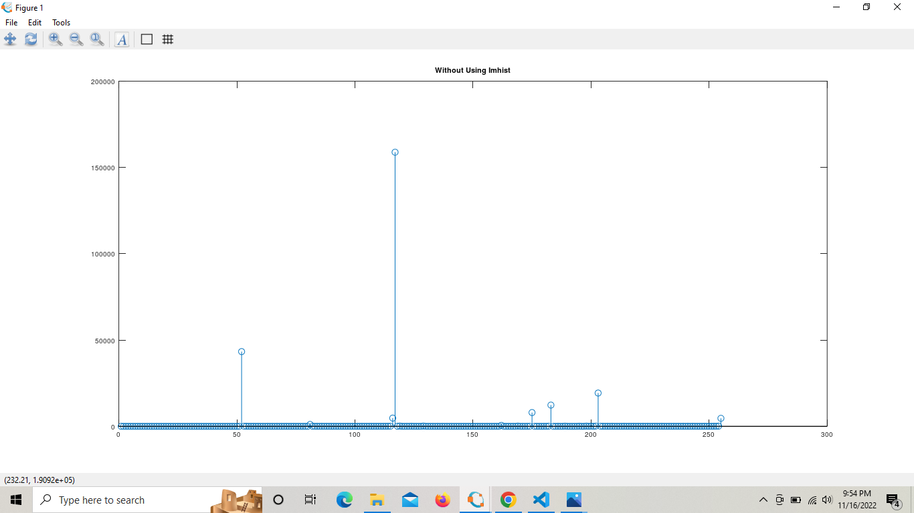
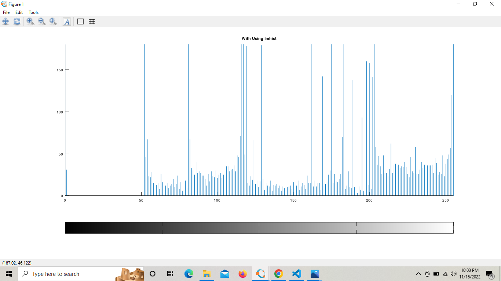
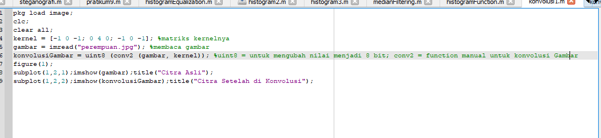
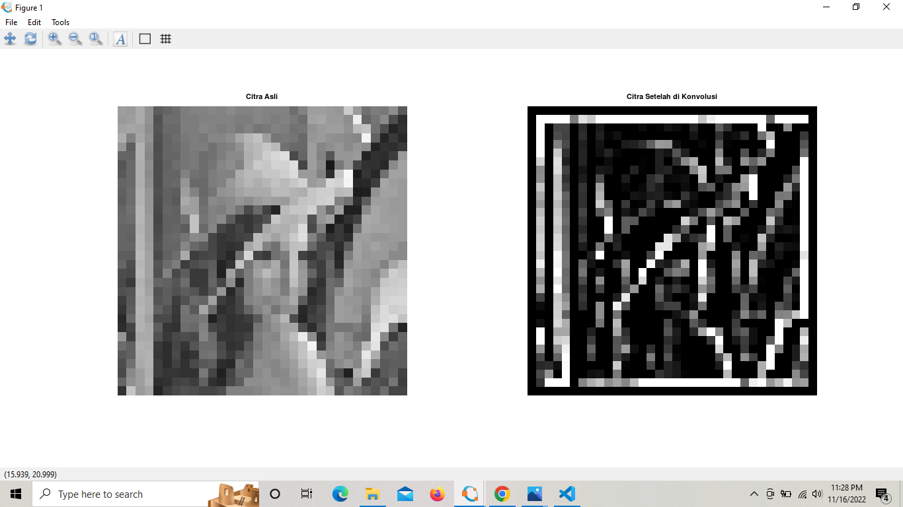

Nama : Maisya Puspita Sari
 NIM : 2110131320006
_____

## Histogram Equalization
Code :

Hasil :

## Imhist Menggunakan Code Manual
Code :

Penjelasan :

* x = imread("inc.png"); (untuk membaca gambar)atau mengambil gambar 
* [row, column] = size(x); %untuk mengambil nilai row dan kolom
* out = zeros(1,255); %zeros : Membuat semua nilai matriks 0

* f = x(i,j); %dalam variabel f disimpan nilai matriks x dengan indeks (baris dan kolom) dengan perulanag i,j / menjalankan semua pixel dalam citra

* if f ~= 0 %ketika nilai f tidak sama dengan 0
out(1,f) = out(1,f)+1; %maka fungsi zeros akan dipanggil lagi
    
* figure, stem(out); %untuk menggambarkan grafik dengan data diskrit. • Terdiri dari grafik batang dua dimensi pada setiap titik sepanjang sumbu x

Hasil Manual:

Hasil Function:

 
 

## Konvolusi Citra 32 x 32
Code :

Hasil :

